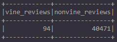
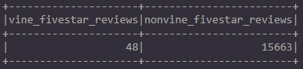

# Amazon Vine Analysis
## Overview
The Amazon Vine program is a service that allows manufacturers and publishers to receive reviews for their products. The purpose of this analysis is to analyse Amazon reviews written by members of the paid Amazon Vine program and determine if there is any bias toward favorable reviews from Vine members. The process will include picking an Amazon Vine dataset and using PySpark to perform the ETL process to extract the dataset, transform the data, connect to an AWS RDS instance, and load the transformed data into pgAdmin. PySpark was then used to determine if there is any bias toward favorable reviews from Vine members in the dataset.

## Results
### Total Reviews

There was a total of 40,565 reviews, with 94 Vine member reviews and 40,471 non-Vine member reviews.

### 5-Star Reviews

There was a total of 15,711 5-star reviews, with 48 5-star Vine member reviews and 15,663 5-star non-Vine member reviews.

### 5-Star Review Percentages

51.06% of Vine member reviews were 5 stars, while 38.70% of non-Vine member reviews were 5 stars.

## Summary
### Positivity Bias
Based on the analysis, it appears that there is a slight bias for reviews in the Vine program. 51.06% of Vine member reviews were 5 stars compared to non-Vine member 5-star reviews at 38.70%. Vine member 5-star reviews were 21.36% higher than non-Vine member 5-star reviews.
### Additional Analysis
In this analysis, we filtered out reviews that had less than 20 helpful votes. We could do an analysis without filtering out any reviews to have a bigger dataset which could potentially provide more insight to support the positivity bias statement. Another option would be to run the same analysis on a different product dataset of Vine and non-Vine member reviews and conduct a 2 sample t-test to determine if there is a statistical difference between the distribution means.
